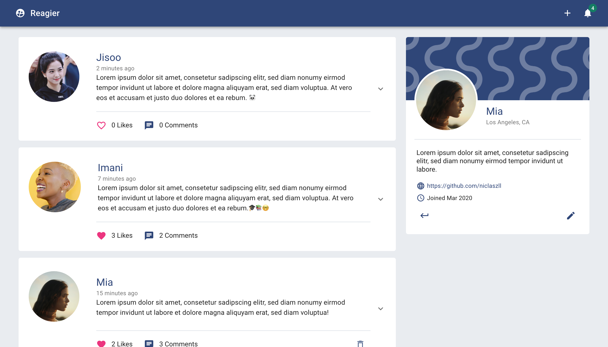
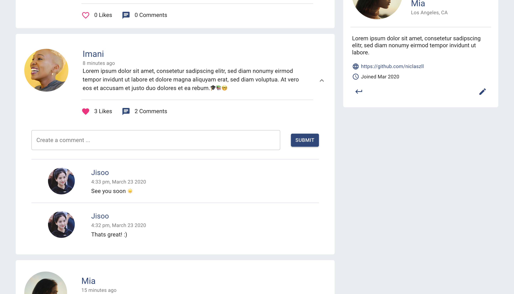
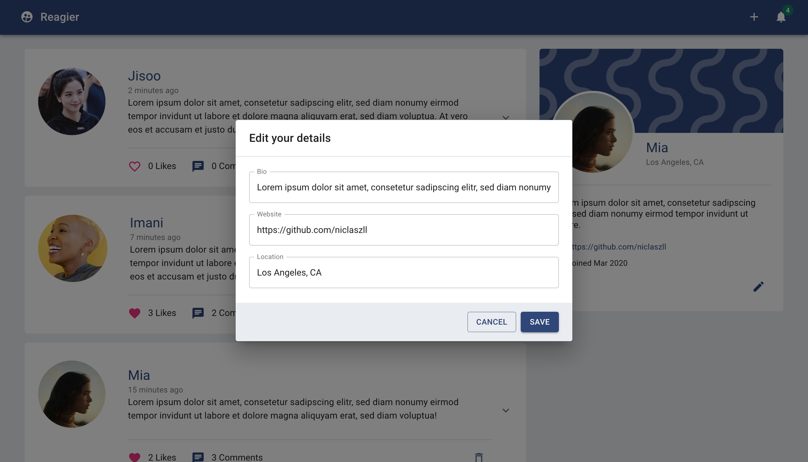
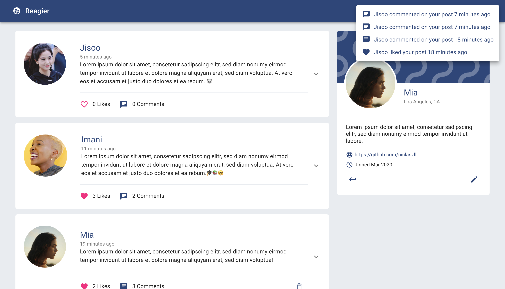
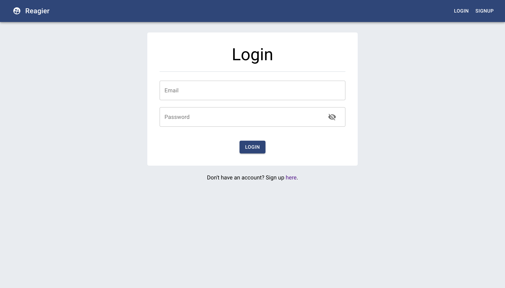
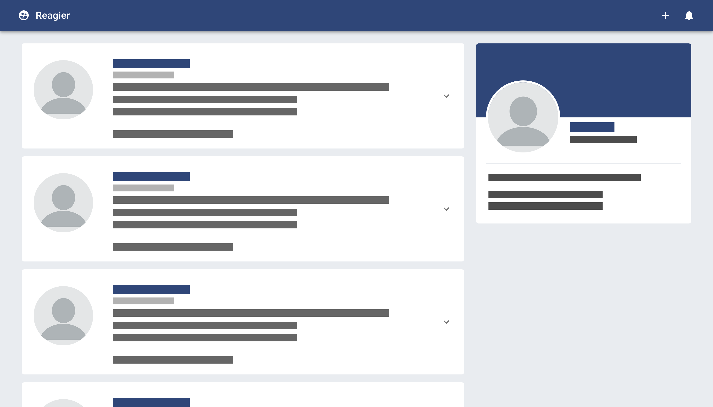

# Reagier - React Social Network

## Overview

The foundation of the frontend for this application are React and Redux together with Material UI as the UI framework.

Firebase is used as a flexible and scalable backend. Cloud functions serve as a REST interface, which provides access to user authentication, storage and the database.

---

## Installation

### Firebase Backend

1. Clone this repository
2. Go to _Firebase_ directory and do `npm install`
3. Create a new [Firebase](https://firebase.google.com/) project
4. Edit [.firebaserc](Firebase/.firebaserc) and [config.js](Firebase/functions/util/config.js) to match your Firebase config ([How to download Firebase config file](https://support.google.com/firebase/answer/7015592?hl=en))
5. Deploy to Firebase via [Firebase CLI](https://firebase.google.com/docs/cli) with `firebase deploy`

Should problems occur, a local project can alternatively be initialized via Firebase CLI first. Then simply insert the folders _handlers_ and _util_, as well as the _index.js_ and _package.json_. More info in the [Firebase CLI Docs](https://firebase.google.com/docs/cli).

### Frontend

1. Go to _Frontend_ directory and do `npm install`
2. Go to [package.json](Frontend/package.json) and change `proxy` to your Firebase API endpoint
3. Go to [App.js](Frontend/src/App.js) and change `axios.defaults.baseURL` to your Firebase API endpoint
4. Start local server via `npm start`. A browser window pointing to http://localhost:3000/ should automatically open.
5. Done :)

---

## Current Features

- Create, like and comment on posts
- Personal user profile consisting of user name, picture, bio, location and website
- Notifications if someone liked or commented on your post

### Screenshots

Expand a post to see and create comments

Edit your user profile

Notifications

Login Screen

While data is fetched a loading skeleton is shown instead of an empty page

---

## Acknowledgement

A big part of this project is based on the [Full Stack React & Firebase series](https://www.youtube.com/watch?v=RkBfu-W7tt0&list=PLMhAeHCz8S38ryyeMiBPPUnFAiWnoPvWP) by [Classed](https://www.youtube.com/channel/UC2-slOJImuSc20Drbf88qvg)/[Hidjou](https://github.com/hidjou). If you are interested in different tutorials in the area of web, please have a look at his channel!
